<html lang="en">
<head>
  <meta charset="UTF-8">
  <meta name="viewport" content="width=device-width, initial-scale=1">
  <meta name="theme-color" content="#60a900">
  <meta name="description" content="Explore beautiful Philippine destinations with Tara Byahe Travel and Tours.">
  <title>Tara Byahe | Travel & Tours</title>
  <link rel="preconnect" href="https://fonts.googleapis.com">
  <link rel="preconnect" href="https://fonts.gstatic.com" crossorigin>
  <link href="https://fonts.googleapis.com/css2?family=Kaushan+Script&family=Poppins:wght@400;500;600;700&display=swap" rel="stylesheet">
  <link href="https://cdn.jsdelivr.net/npm/remixicon@3.2.0/fonts/remixicon.css" rel="stylesheet">
  <link rel="stylesheet" href="styles.css">
  
</head>
<body>
  <a class="skip-link" href="#main">Skip to content</a>
  <nav class="nav__container" aria-label="Main navigation">
    <a class="nav__logo" href="#home" aria-label="Tara Byahe home">
      
      Tara <b>Byahe!</b>
    </a>
    <button class="nav__menu__btn" id="menu-btn" aria-label="Open navigation menu" aria-expanded="false" aria-controls="nav-links">
      <i class="ri-menu-line" aria-hidden="true"></i>
    </button>
    <ul class="nav__links" id="nav-links">
      <li><a href="#home">Home</a></li>
      <li><a href="#tours">Tour Packages</a></li>
      <li><a href="#destinations">Destinations</a></li>
      <li><a href="#gallery">Gallery</a></li>
      <li><a href="#about">About Us</a></li>
      <li><a class="nav__book" href="#booking">Book a Trip</a></li>
    </ul>
  </nav>

  <main id="main">
    <header id="home" class="hero">
      

        
Discover the beauty of the Philippines

        <h1>TARA BYAHE!</h1>
        
Your next unforgettable island adventure starts here.

        <a class="btn" href="#tours">Explore Our Tours <i class="ri-arrow-right-line" aria-hidden="true"></i></a>
      

    </header>

    <section class="section__container booking-wrap" id="booking">
      

        
Your adventure begins

        <h2 class="section__title">Plan Your Trip</h2>
        
Tell us what you have in mind and prepare for your next getaway.

      

      <form class="booking-form" id="booking-form">
        <label>Full name<input type="text" name="name" placeholder="Your full name" autocomplete="name" required></label>
        <label>Email address<input type="email" name="email" placeholder="you@example.com" autocomplete="email" required></label>
        <label>Destination
          <select name="destination" id="booking-destination" required>
            <option value="">Choose a destination</option>
            <option>Coron Island</option><option>Siargao</option><option>Boracay</option>
            <option>Bohol</option><option>El Nido</option><option>Calamian Islands</option>
            <option>Palawan</option><option>Custom destination</option>
          </select>
        </label>
        <label>Preferred travel date<input type="date" name="date" id="travel-date" required></label>
        <label>Number of travelers
          <select name="travelers" required>
            <option value="1">1 traveler</option><option value="2" selected>2 travelers</option>
            <option value="3">3 travelers</option><option value="4">4 travelers</option>
            <option value="5">5 travelers</option><option value="6+">6 or more</option>
          </select>
        </label>
        <label class="form-wide">Additional requests<textarea name="message" rows="3" placeholder="Activities, questions, or special requests (optional)"></textarea></label>
        <button class="btn form-wide" type="submit">Prepare Booking Request <i class="ri-send-plane-line" aria-hidden="true"></i></button>
        
This demo prepares your request on this page; it does not send a booking or payment.

        

      </form>
    </section>

    <section class="section__container tour__section" id="tours">
      
Ready, set, explore

      <h2 class="section__title">Featured Tour Packages</h2>
      
Sample package prices are shown for planning and should be confirmed with the agency.

      

        <article class="tour__card">
          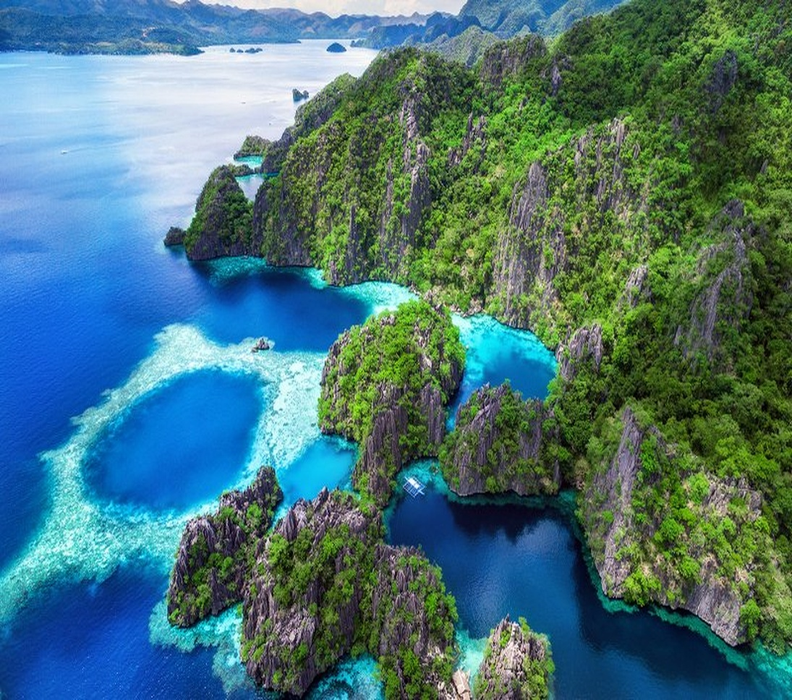
          
Island escape<h3>Coron Island</h3>
<i class="ri-calendar-line"></i> 7 Days

From ₱40,000
<button class="btn btn-small choose-tour" data-destination="Coron Island">Choose this tour</button>

        </article>
        <article class="tour__card">
          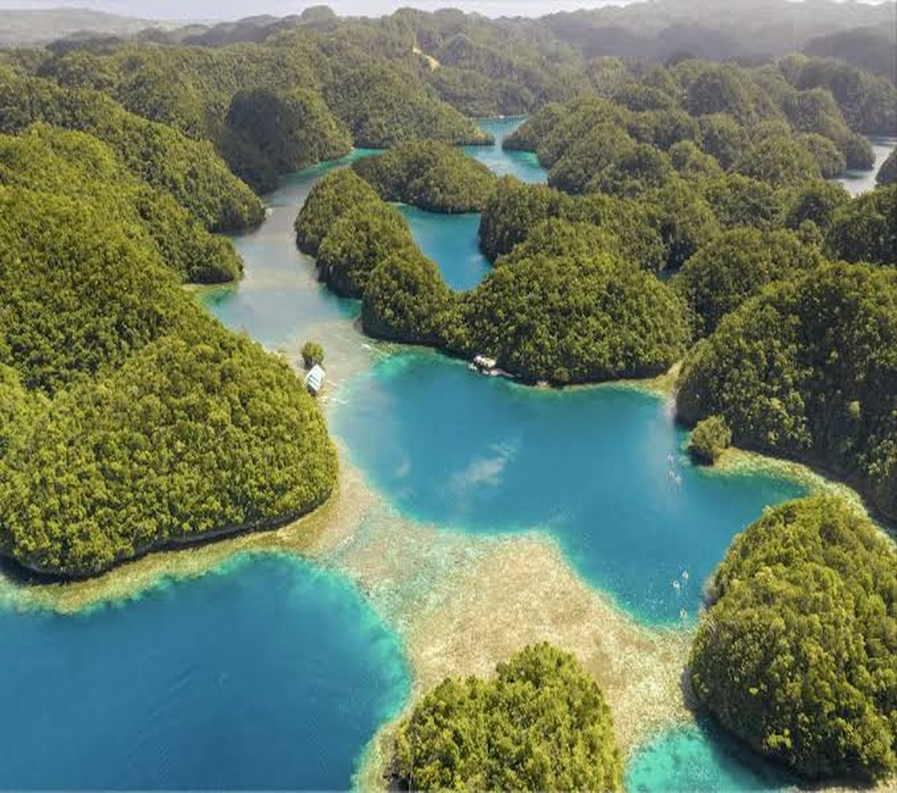
          
Surf & unwind<h3>Siargao</h3>
<i class="ri-calendar-line"></i> 7 Days

From ₱30,000
<button class="btn btn-small choose-tour" data-destination="Siargao">Choose this tour</button>

        </article>
        <article class="tour__card">
          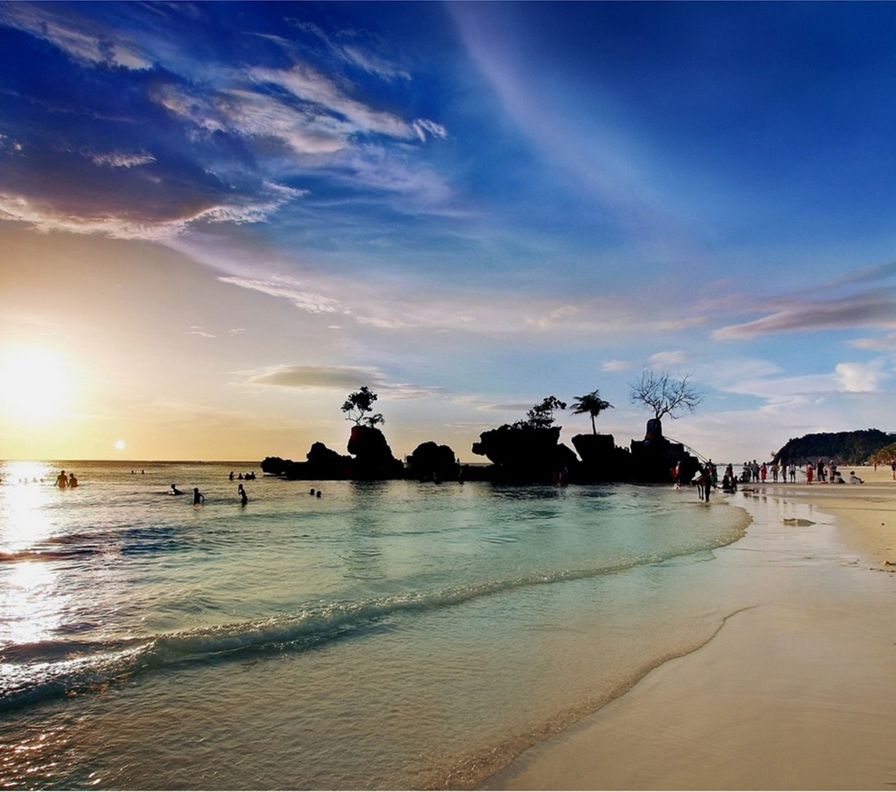
          
Beach holiday<h3>Boracay</h3>
<i class="ri-calendar-line"></i> 7 Days

From ₱50,000
<button class="btn btn-small choose-tour" data-destination="Boracay">Choose this tour</button>

        </article>
        <article class="tour__card">
          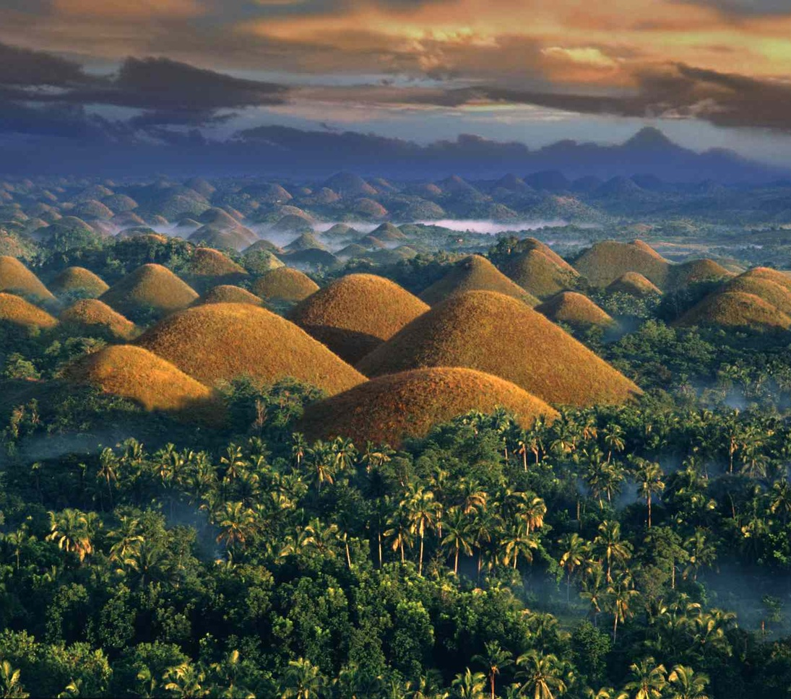
          
Nature & culture<h3>Bohol</h3>
<i class="ri-calendar-line"></i> 7 Days

From ₱20,000
<button class="btn btn-small choose-tour" data-destination="Bohol">Choose this tour</button>

        </article>
      

    </section>

    <section class="section__container holiday__container" id="destinations">
      
Find your happy place

      <h2 class="section__title">Choose Your Perfect Holiday</h2>
      
From white-sand beaches to dramatic limestone cliffs, find a destination that fits your travel style.

      

        <article class="holiday__card">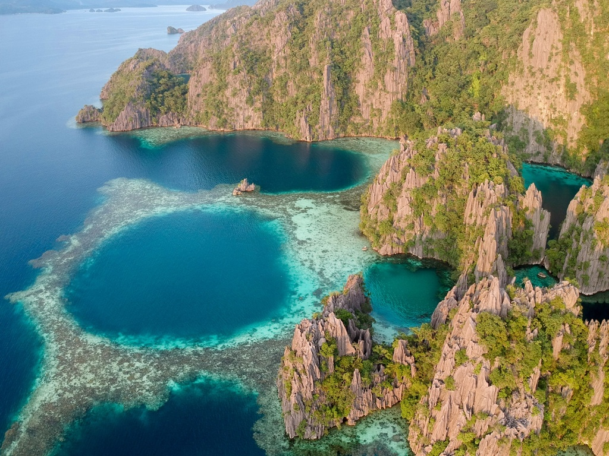
<h3>Coron Island</h3>
Lagoon views, island hopping, and clear waters.
<button class="text-btn choose-tour" data-destination="Coron Island">Plan this trip <i class="ri-arrow-right-line"></i></button>
</article>
        <article class="holiday__card">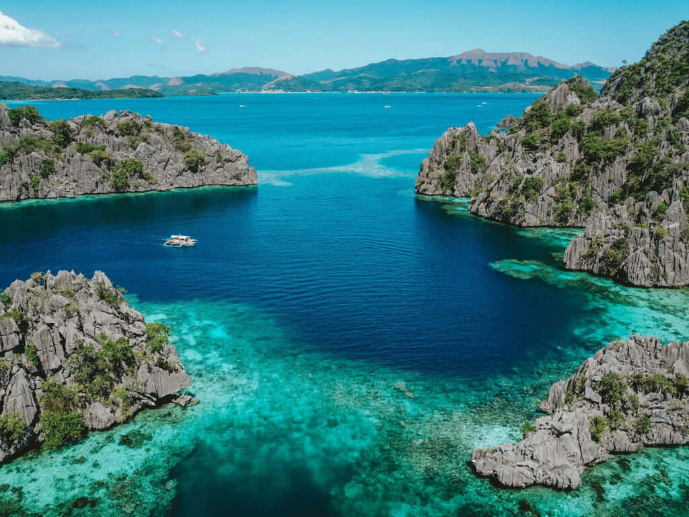
<h3>Calamian Islands</h3>
Quiet coves and beautiful island scenery.
<button class="text-btn choose-tour" data-destination="Calamian Islands">Plan this trip <i class="ri-arrow-right-line"></i></button>
</article>
        <article class="holiday__card">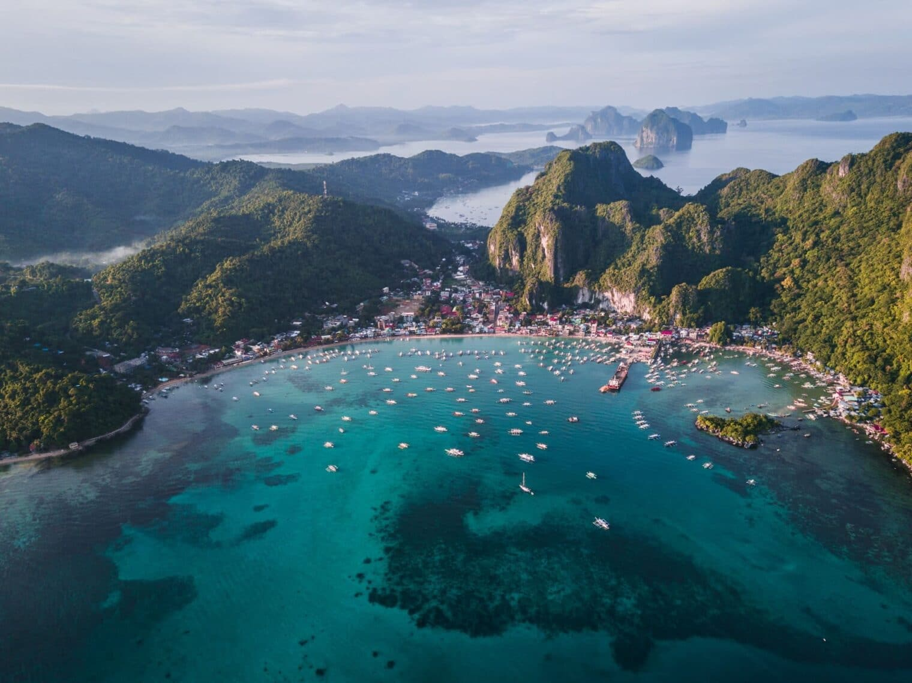
<h3>El Nido</h3>
Explore lagoons and towering karst formations.
<button class="text-btn choose-tour" data-destination="El Nido">Plan this trip <i class="ri-arrow-right-line"></i></button>
</article>
        <article class="holiday__card">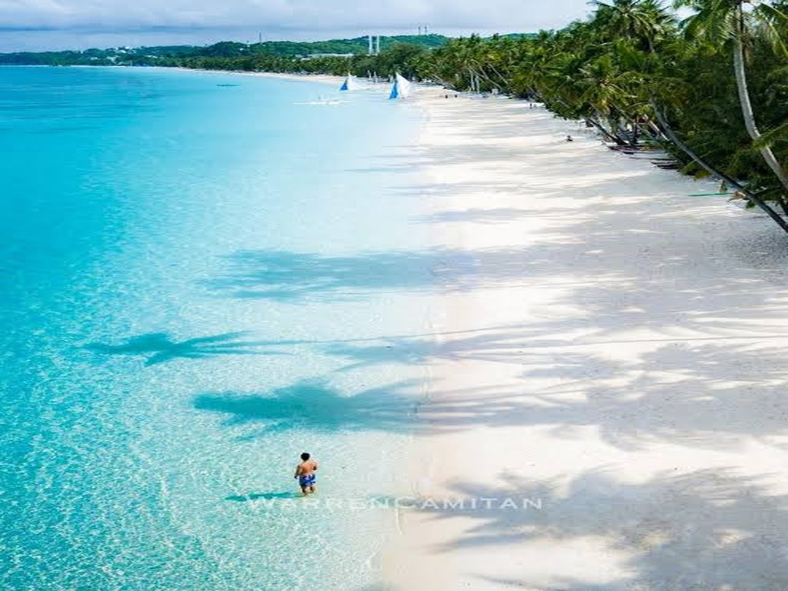
<h3>Boracay Island</h3>
Soft white sand, sunsets, and beach activities.
<button class="text-btn choose-tour" data-destination="Boracay">Plan this trip <i class="ri-arrow-right-line"></i></button>
</article>
        <article class="holiday__card">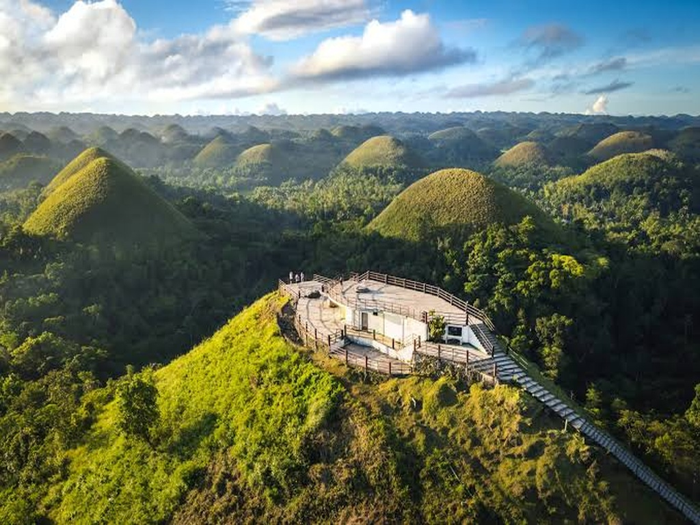
<h3>Chocolate Hills</h3>
A one-of-a-kind natural wonder in Bohol.
<button class="text-btn choose-tour" data-destination="Bohol">Plan this trip <i class="ri-arrow-right-line"></i></button>
</article>
        <article class="holiday__card">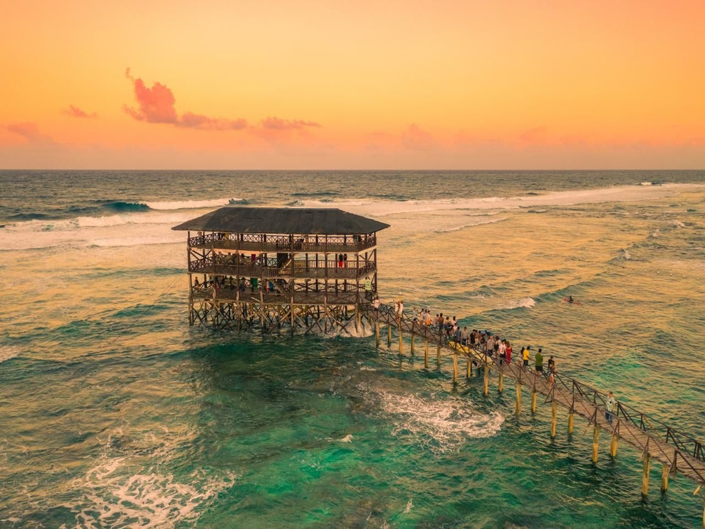
<h3>Siargao</h3>
Surf spots, palms, and laid-back island life.
<button class="text-btn choose-tour" data-destination="Siargao">Plan this trip <i class="ri-arrow-right-line"></i></button>
</article>
      

      <button class="btn view-all" id="view-all" type="button" aria-expanded="false">Show all destinations</button>
    </section>

    <section class="vacation" aria-label="Vacation inspiration">
      

        
Make room for wonder
<h2 class="section__title">Your Next Vacation</h2>
        
Feet are tired, but the heart is happy.

        

          <video src="ELNIDO1.mp4" autoplay controls muted playsinline preload="metadata" poster="elnido.jpg">
            Your browser does not support embedded video. Please update your browser.
          </video>
        

      

    </section>

    <section class="section__container gallery-section" id="gallery">
      
Little moments, lasting memories
<h2 class="section__title">Destination Gallery</h2>
      
Select any photo to view it larger.

      

        <button class="destination__card gallery-item" data-image="destination.jpg" data-title="Siargao" aria-label="View Siargao photo">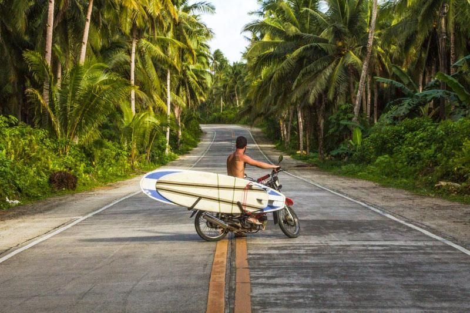Siargao</button>
        <button class="destination__card gallery-item" data-image="boracay2.png" data-title="Boracay" aria-label="View Boracay photo">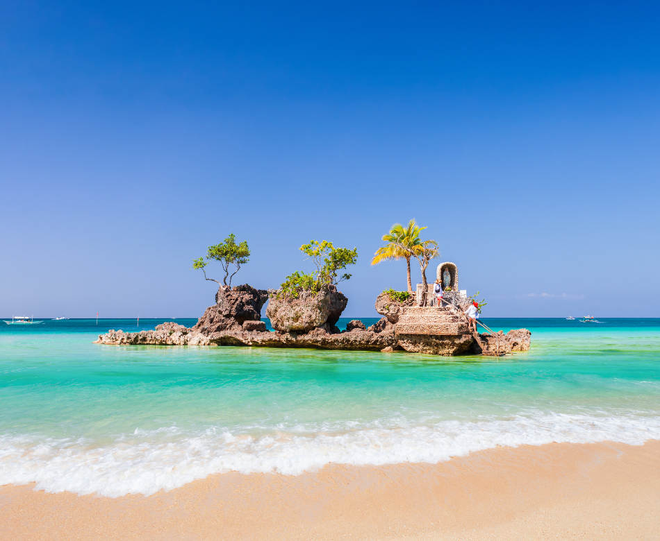Boracay</button>
        <button class="destination__card gallery-item" data-image="palawan2.jpg" data-title="Palawan" aria-label="View Palawan photo">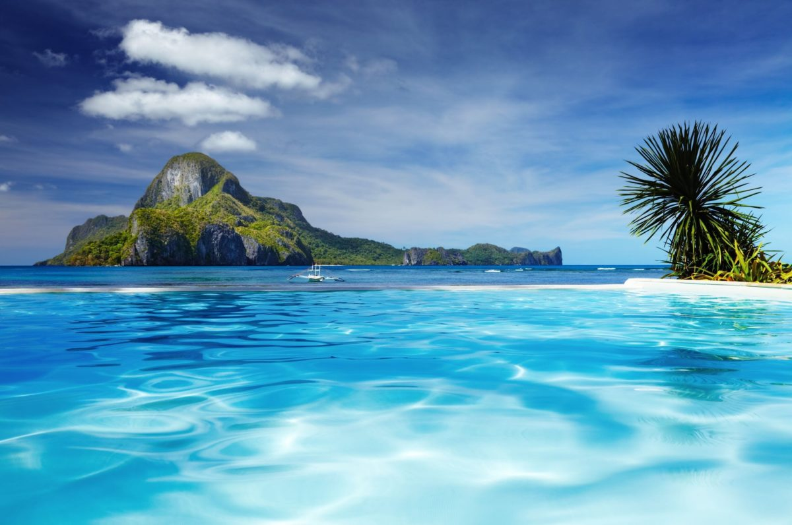Palawan</button>
        <button class="destination__card gallery-item" data-image="bohol2.jpg" data-title="Bohol" aria-label="View Bohol photo">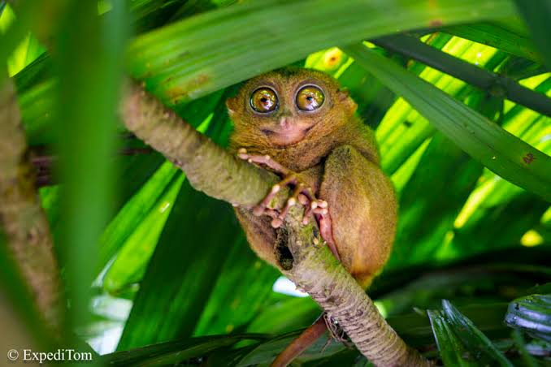Bohol</button>
        <button class="destination__card gallery-item" data-image="elnido.jpg" data-title="El Nido" aria-label="View El Nido photo">El Nido</button>
        <button class="destination__card gallery-item" data-image="calamian.jpeg" data-title="Calamian" aria-label="View Calamian photo">Calamian</button>
      

    </section>

    <section class="about-section" id="about">
      

        

A little about us
<h2 class="section__title">Tara Byahe Travel and Tours</h2>
Tara Byahe Travel and Tours is a travel agency based in Coron, Palawan, offering affordable and convenient travel services. We help travelers explore beautiful destinations and enjoy memorable, hassle-free journeys.

        
<article><i class="ri-eye-line"></i>
<h3>Our Vision</h3>
To be a trusted travel and tour provider that inspires people to explore the Philippines.

</article><article><i class="ri-heart-line"></i>
<h3>Our Mission</h3>
To provide affordable, safe, and memorable travel services while promoting local destinations and communities.

</article><article><i class="ri-shield-check-line"></i>
<h3>Our Promise</h3>
Convenient, enjoyable, and memorable journeys—with friendly service every step of the way.

</article>

      

    </section>
  </main>

  <footer id="contact">
    

      
<a class="footer-brand" href="#home">Tara Byahe!</a>
Travel makes one modest. You see what a tiny place you occupy in the world.

      
<h3>Explore</h3><a href="#tours">Tour Packages</a><a href="#destinations">Destinations</a><a href="#gallery">Gallery</a>

      
<h3>Contact & Social</h3>
Coron, Palawan, Philippines

        <a href="https://www.facebook.com/" target="_blank" rel="noopener noreferrer" aria-label="Facebook"><i class="ri-facebook-fill"></i></a>
        <a href="https://www.instagram.com/" target="_blank" rel="noopener noreferrer" aria-label="Instagram"><i class="ri-instagram-line"></i></a>
        <a href="https://www.tiktok.com/" target="_blank" rel="noopener noreferrer" aria-label="TikTok"><i class="ri-tiktok-line"></i></a>
      
<a href="#booking">Make a booking request</a>

    

    
©  Tara Byahe Travel and Tours. Explore the Philippines!

  </footer>

  <dialog id="lightbox" class="lightbox">
    <button type="button" class="lightbox-close" id="lightbox-close" aria-label="Close image viewer"><i class="ri-close-line"></i></button>
    
    

  </dialog>
</body>
</html>
